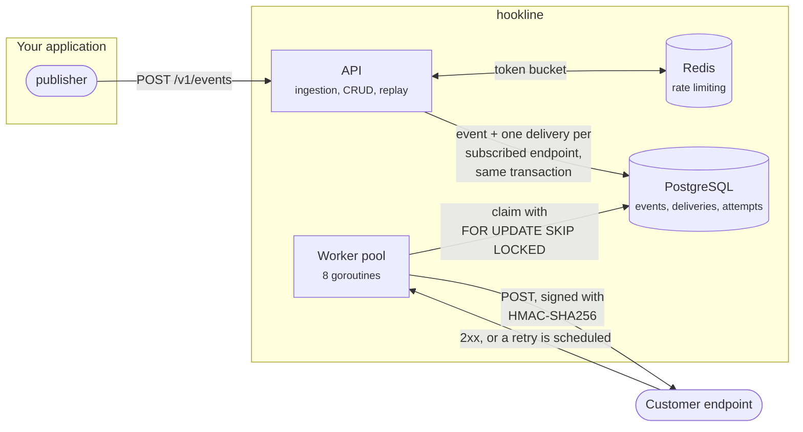

# hookline

Reliable webhook delivery as a service — sign it, retry it, and never lose it.

[](https://github.com/Gustavo-Leite/hookline/actions/workflows/ci.yml)
[](LICENSE)

> **Status: feature complete, no public instance.** Everything described below
> runs: ingestion, fan-out, signing, retries with backoff, dead-lettering,
> replay, rate limiting, metrics and encryption at rest. It is a portfolio
> project — see [Deploying](#deploying) for what running it for real would take.

**[What it is](#what-it-is)** ·
**[How it works](#how-it-works)** ·
**[Getting started](#getting-started)** ·
**[Development](#development)** ·
**[Load test](#load-test)** ·
**[Security](#security)** ·
**[Deploying](#deploying)** ·
**[Design decisions](#design-decisions)** ·
**[Roadmap](#roadmap)**

## What it is

Sending a webhook is easy. *Guaranteeing* it arrives is not.

The receiver is down for six hours. The connection times out after the handler
already ran, so a retry would deliver twice. The receiver has no way to tell
your request apart from an attacker's. Every team that ships webhooks rebuilds
the same machinery to handle this, usually badly, usually inline with the
request that triggered the event.

hookline is that machinery, extracted: you register endpoints, you `POST` an
event, and the service owns delivery from there — signing each request,
retrying with exponential backoff, parking what it cannot deliver in a
dead-letter queue, and keeping a full attempt history you can inspect and
replay.

## How it works



The API answers `202` as soon as the event is durable. Everything after that —
picking the subscribed endpoints, signing, retrying, giving up — belongs to the
worker, and the queue between them is what lets ingestion stay fast while a
receiver is slow or down.

## Why it exists

This is a portfolio project, and it is deliberately not a CRUD app. It is a
small distributed system, so almost every part of it is a real design decision
with a real trade-off: at-least-once versus exactly-once, queue in Postgres
versus Redis, how long to keep retrying a dead endpoint, how to make an
ingestion endpoint idempotent. Those decisions are documented as they are made.

## Tech stack

| Layer | Choice |
|---|---|
| Language | Go 1.27 |
| Queue | PostgreSQL with `FOR UPDATE SKIP LOCKED` |
| HTTP | `net/http` (standard library routing) |
| Database | PostgreSQL 18 via `pgx` |
| Cache / rate limiting | Redis 8 |
| Migrations | goose (plain SQL) |
| API docs | OpenAPI 3.0 + Swagger UI, both embedded in the binary |
| Logging | `log/slog` (structured JSON) |
| Metrics | Prometheus + Grafana, provisioned in Compose |
| Lint | golangci-lint v2 |
| CI | GitHub Actions |
| Local infra | Docker Compose |

## Getting started

### Prerequisites

To **run** it, one thing:

- Docker 24+ with Compose v2 (`docker compose version`)

To **work on the code**, two more:

- [Go 1.27+](https://go.dev/dl/) — the version is pinned in `go.mod`
- [goose](https://github.com/pressly/goose) for migrations:
  `go install github.com/pressly/goose/v3/cmd/goose@latest`

Everything else — Postgres 18, Redis 8, Prometheus, Grafana, the Go toolchain
used for builds — runs in containers.

### Run it

```bash
git clone https://github.com/Gustavo-Leite/hookline.git
cd hookline

make setup                  # writes .env with a freshly generated encryption key
docker compose up -d --build
```

`make setup` is `cp .env.example .env` plus one generated secret. Doing it by
hand is the same thing:

```bash
cp .env.example .env
docker compose run --rm admin generate-key   # paste the line into .env
```

The service refuses to start without `SECRET_ENCRYPTION_KEY`, and the example
file ships it empty on purpose — a key committed to a public repository would
protect nothing.

That is the whole setup. Compose starts Postgres and Redis, waits for both to
report healthy, applies the pending migrations in a one-shot container, and then
starts the API and the delivery worker:

```bash
curl -s localhost:8080/healthz    # {"status":"ok"}
curl -s localhost:8080/readyz     # {"postgres":"ok","redis":"ok"}
```

### API reference

Open **<http://localhost:8080/docs>** — every route, schema and error code, with
a form to try each one against your own instance. The raw specification is at
`/openapi.yaml`, ready to import into Postman or Insomnia, or to generate a
client from.

Swagger UI ships inside the binary, so the page needs no CDN and works offline.

### Dashboards

`docker compose up` also starts Prometheus and Grafana, already wired together:

| | |
|---|---|
| <http://localhost:3000/d/hookline> | the dashboard — traffic, latency, delivery outcomes, queue depth |
| <http://localhost:9090> | Prometheus, for ad-hoc queries |
| `/metrics` on the API, `:9090/metrics` on the worker | the raw exposition |

Grafana opens straight into the dashboard: anonymous viewing is on and the
datasource and dashboard are provisioned from `deploy/`, so there is nothing to
click through and no password to type.

### Get an API key

Every other route requires one. There is no signup flow — the first application
and its key are created from the command line, by whoever can reach the host:

```bash
docker compose run --rm admin create-application "my app"
```

The same CLI lists and revokes keys, and generates the encryption key the
service needs:

```bash
docker compose run --rm admin generate-key
docker compose run --rm admin list-keys <application-id>
docker compose run --rm admin revoke-key <key-id>
```

The key is printed once and never again; only its SHA-256 hash reaches the
database. Losing it means creating a new one.

```bash
export HOOKLINE_KEY=hl_test_...

curl -s localhost:8080/v1/me -H "Authorization: Bearer $HOOKLINE_KEY"

curl -s -X POST localhost:8080/v1/endpoints \
  -H "Authorization: Bearer $HOOKLINE_KEY" \
  -H "Content-Type: application/json" \
  -d '{"url":"https://example.com/hooks","event_types":["user.created"]}'
```

The endpoint's signing secret comes back in that response, and only there.

```bash
curl -s -X POST localhost:8080/v1/events \
  -H "Authorization: Bearer $HOOKLINE_KEY" \
  -H "Content-Type: application/json" \
  -H "Idempotency-Key: $(uuidgen)" \
  -d '{"type":"user.created","payload":{"id":42}}'
```

The response is `202`: the event is stored and queued, not delivered yet. The
worker picks it up within a second, and what happened is visible here:

```bash
curl -s localhost:8080/v1/deliveries -H "Authorization: Bearer $HOOKLINE_KEY"
curl -s localhost:8080/v1/deliveries/<id> -H "Authorization: Bearer $HOOKLINE_KEY"

# send a dead-lettered delivery again, with a fresh set of retries
curl -s -X POST localhost:8080/v1/deliveries/<id>/replay -H "Authorization: Bearer $HOOKLINE_KEY"
```

```bash
docker compose ps            # what is running
docker compose logs -f worker
docker compose down          # stop everything, keep the data
docker compose down -v       # stop everything and wipe the database
```

### Receiving webhooks

Every delivery arrives as a `POST` carrying four headers:

| Header | Meaning |
|---|---|
| `Hookline-Event-Id` | the event's id, stable across retries |
| `Hookline-Event-Type` | what happened |
| `Hookline-Timestamp` | when the request was signed, in Unix seconds |
| `Hookline-Signature` | `v1,<base64 HMAC-SHA256>` |

The signature covers `{event_id}.{timestamp}.{raw body}`, keyed with the
endpoint secret. Verifying it takes a few lines in any language:

```js
const crypto = require("node:crypto");

function verify(secret, headers, rawBody) {
  const timestamp = headers["hookline-timestamp"];

  if (Math.abs(Date.now() / 1000 - Number(timestamp)) > 300) {
    return false; // outside the five-minute window: treat it as a replay
  }

  const [version, provided] = headers["hookline-signature"].split(",");
  if (version !== "v1") return false;

  const expected = crypto
    .createHmac("sha256", secret)
    .update(`${headers["hookline-event-id"]}.${timestamp}.${rawBody}`)
    .digest("base64");

  return crypto.timingSafeEqual(Buffer.from(provided), Buffer.from(expected));
}
```

Three things matter here. Verify against the **raw** body, before any JSON
parsing — re-serializing changes bytes and breaks the signature. Compare in
constant time; a plain `===` leaks how many bytes an attacker got right. And
check the timestamp, otherwise a captured request stays valid forever.

Deliveries are **at-least-once**: a receiver that times out after doing the work
will be tried again. Use `Hookline-Event-Id` to make your handler idempotent.

### Configuration

Every variable lives in `.env.example`, ready to copy.

| Variable | Default | Description |
|---|---|---|
| `APP_ENV` | `development` | Environment name |
| `HTTP_PORT` | `8080` | Port the API listens on |
| `LOG_LEVEL` | `info` | Log verbosity |
| `POSTGRES_USER` / `POSTGRES_PASSWORD` / `POSTGRES_DB` | `hookline` | Credentials used by the Postgres container |
| `POSTGRES_PORT` | `5432` | Host port mapped to Postgres |
| `REDIS_PORT` | `6379` | Host port mapped to Redis |
| `DATABASE_URL` | `postgres://…@localhost:5432/…` | Connection string, for running the service on the host |
| `REDIS_URL` | `redis://localhost:6379/0` | Redis connection string, same |
| `GOOSE_DRIVER` / `GOOSE_DBSTRING` / `GOOSE_MIGRATION_DIR` | — | Read automatically by the goose CLI |
| `ALLOW_PRIVATE_DELIVERY_TARGETS` | `false` | Development only: lets the worker deliver to loopback and private addresses |
| `RATE_LIMIT_PER_MINUTE` | `600` | Sustained request allowance per API key |
| `RATE_LIMIT_BURST` | `60` | How many requests can arrive at once |
| `METRICS_PORT` | `9090` | Port the worker exposes `/metrics` on |
| `PROMETHEUS_PORT` / `GRAFANA_PORT` | `9090` / `3000` | Host ports for the dashboards |
| `SECRET_ENCRYPTION_KEY` | — | **Required.** 32 random bytes, base64: `docker compose run --rm admin generate-key` |

`DATABASE_URL` and `REDIS_URL` point at `localhost`, which is what a process on
your machine needs. Containers reach the same services by name — `postgres` and
`redis` — so the `api` service overrides both in `docker-compose.yml`. That way
one `.env` serves both ways of running it, with nothing to edit when you switch.

## Development

```bash
make dev
```

Same stack, except the API container rebuilds and restarts itself whenever a
`.go` file changes, and then follows its logs. Nothing else to install: Go,
`air` and the module cache all live inside the container.

That comes from `docker-compose.dev.yml`, an overlay that swaps the compiled
image for a development one. It is never loaded on its own, so `docker compose
up` — the command in the quick start, and the one CI runs — still exercises the
real image.

| | |
|---|---|
| `make dev` | hot reload, for working on the code |
| `make up` | the compiled image, exactly as a release runs |
| `make admin name="my app"` | create an application and its first API key |
| `make down` | stop everything |
| `make loadtest key=...` | run the k6 ingestion test |
| `make test` / `make test-unit` | everything, or only what needs no Docker |
| `make cover` | test coverage |
| `make lint` / `make vuln` | golangci-lint, govulncheck |

Prefer running the binary on the host? `docker compose up -d postgres redis
migrate` brings up only the dependencies, and `go run ./cmd/api` or `air` takes
it from there — just remember that the `api` container and the host process
cannot both hold port 8080.

To watch readiness do its job, stop a dependency while the service is running:

```bash
docker compose stop redis
curl -i -s localhost:8080/readyz    # 503, redis "unavailable"
curl -i -s localhost:8080/healthz   # 200, the process is still alive
docker compose start redis
```

### Tests

```bash
make test        # everything, with the race detector
make test-unit   # only what runs without Docker
make cover       # coverage report
```

Two kinds of test, deliberately:

**Unit tests** cover the parts where the logic lives — signing, backoff, the
retry policy, idempotency fingerprints, the HTTP handlers against fake stores.
They need nothing but Go.

**Integration tests** run the SQL against a real PostgreSQL 18 that
`testcontainers-go` starts and throws away, with the project's own migrations
applied. That is where the queries that cannot be faked are checked: the tenant
filter that keeps one customer from reading another's signing secret, the
fan-out that must skip disabled and unsubscribed endpoints, `SKIP LOCKED`
handing each delivery to exactly one of two concurrent workers, and the secret
being unreadable in the column. They skip under `-short`.

```
internal/event      100%     internal/postgres    80%
internal/delivery    94%     internal/ratelimit   78%
internal/worker      93%     internal/config      77%
internal/secrets     86%     internal/httpapi     60%
                             internal/apikey      57%
```

The `cmd/` packages sit at 0% on purpose: they only wire dependencies together,
and the compose smoke test in CI is what proves that wiring works.

CI runs all of it on every push, plus `govulncheck` and a smoke test that builds
the images, brings the whole stack up with Docker Compose and asserts `/readyz`
answers — so the quick start above cannot silently rot.

### Project layout

```
cmd/api/             the HTTP service
cmd/worker/          the delivery worker
cmd/hookline-admin/  creates applications and their first API key
api/                 the OpenAPI specification, embedded into the binary
internal/config/     environment parsing, validated at boot
internal/apikey/     key generation, hashing and validity rules
internal/endpoint/   webhook destinations and their signing secrets
internal/event/      published events and their idempotency fingerprint
internal/delivery/   signing, backoff, retry policy and the HTTP sender
internal/worker/     the pool that drains the queue
internal/httpapi/    HTTP handlers and middleware
internal/postgres/   connection pool, data access and the queue
internal/redis/      Redis client
migrations/          versioned SQL, applied with goose
```

The API and the worker are separate binaries on purpose: ingestion and delivery
have very different load profiles, and separating them means scaling one without
the other.

`internal/` is enforced by the compiler: nothing outside this module can import
it. Packages are named after what they adapt, and interfaces are declared by
the code that consumes them rather than the code that implements them — so they
stay small and easy to fake in tests.

## Load test

`deploy/k6/ingest.js` hammers `POST /v1/events`, the hot path. Everything —
API, worker, Postgres, Redis — runs in Docker on one machine (Ryzen 7 5700X, 16
threads), so these are single-box numbers, not a capacity plan.

```bash
make loadtest key=hl_test_...
```

25 virtual users, 55 seconds, rate limiting raised for the run:

| | Without fan-out | With one subscribed endpoint |
|---|---|---|
| Throughput | **8 077 req/s** | **6 720 req/s** |
| Latency avg | 2.61 ms | 3.14 ms |
| Latency p95 | 3.44 ms | 4.21 ms |
| Latency p99 | — | 11.16 ms |
| Failed requests | 0 of 444 252 | 0 of 369 587 |

The second column is the honest one: it includes the fan-out `INSERT` that
creates a delivery row inside the same transaction as the event. Roughly 20% of
the throughput buys atomicity between accepting an event and queueing it.

That run left 369 587 deliveries queued, which is also the point — ingestion is
meant to outrun delivery, and the queue is what absorbs the difference.

**What this does not measure:** delivery throughput. Draining that queue means
making hundreds of thousands of real outbound requests, which needs a receiver
built for it. Until that exists, the number would be about whatever server was
on the other end, not about hookline.

## Security

What the service does, and where it stops.

| Control | How |
|---|---|
| API keys | 256 bits from `crypto/rand`, stored as SHA-256, compared by an index lookup |
| Endpoint secrets | AES-256-GCM at rest, returned once at creation and never again |
| Outgoing requests | signed with HMAC-SHA256 over `{event_id}.{timestamp}.{body}`, five-minute replay window |
| Tenant isolation | every query filters by `application_id`, so another tenant's row is a `404` |
| SSRF | the dialer refuses loopback, private, link-local and multicast addresses, after DNS resolution and before connect; redirects are not followed |
| Abuse | token bucket per credential, applied **before** authentication so an invalid key cannot cost a database lookup |
| Logs | connection errors and credentials never reach a response body; the `X-Request-Id` a client sends is length- and charset-checked before being logged |

**What is not covered.** There is no user-facing signup, so there is no password
handling, session, or CSRF surface. Rate limiting buckets unauthenticated
callers by `RemoteAddr`; behind a proxy that becomes the proxy's address, so a
deployment behind one needs a trusted-header configuration that does not exist
yet. Secrets are encrypted with a single key and there is no re-encryption path,
so rotating it invalidates what is already stored.

## Deploying

There is no public instance — this is a portfolio project, and running a webhook
sender open to the internet is a liability, not a demo. Everything below is what
it would take, and the pieces are in place for it.

The images are the same ones `docker compose` builds: `api`, `worker` and
`migrate` targets in the `Dockerfile`, each a distroless image under 21 MB
running as a non-root user. Any platform that takes a container works —
Fly.io, Render, ECS, a Kubernetes cluster. The API and the worker scale
independently, and the worker holds no state, so running several is safe:
`SKIP LOCKED` is what keeps them from colliding.

**Before pointing it at real traffic:**

- [ ] Generate a fresh `SECRET_ENCRYPTION_KEY` and keep it in a secret manager, not in `.env`
- [ ] Replace `POSTGRES_PASSWORD`; the default is `change-me` for a reason
- [ ] Leave `ALLOW_PRIVATE_DELIVERY_TARGETS` unset — it exists so the project can be demonstrated on a laptop
- [ ] Stop publishing the Postgres and Redis ports to the host
- [ ] Terminate TLS in front of the API
- [ ] Point Prometheus at the two `/metrics` endpoints from outside the compose network
- [ ] Set `APP_ENV=production` so generated keys carry the `hl_live_` prefix

## Design decisions

Decisions worth defending, and what each one costs.

**UUIDv7 for primary keys.** Postgres 18 ships `uuidv7()` natively. UUIDv4 is
random, so every insert lands on a random B-tree page and the index fragments
under write load. UUIDv7 carries a timestamp prefix, so inserts are close to
sequential like a `bigserial` — without leaking row counts or requiring a round
trip to generate the key. The cost is 16 bytes per key instead of 8, and rows
leak their creation time to anyone holding an ID.

**Endpoint secrets are stored recoverable, not hashed.** API keys are hashed,
because verifying them only requires a comparison. Endpoint secrets cannot be:
computing the HMAC-SHA256 signature of every outgoing request needs the
original value, and hashing is one-way. They should therefore be encrypted at
rest with an application key — currently they are not, which is tracked in the
roadmap below. Pretending a hash would work here is the common mistake.

**Liveness and readiness are separate endpoints.** `/healthz` answers "is the
process alive?" and deliberately touches no dependency. `/readyz` answers "can
it serve traffic?" and pings Postgres and Redis under a 2s deadline. Collapsing
the two means a briefly flapping database gets your healthy process killed and
restarted by the orchestrator, which helps nobody.

**Readiness failures are logged in full and reported vaguely.** The response
says `"unavailable"`; the log holds the actual error. Connection errors carry
hosts, ports and sometimes usernames, and that does not belong in an HTTP
response body.

**API keys are hashed with SHA-256, not bcrypt.** bcrypt is the right answer for
passwords, which humans choose badly and reuse everywhere: a slow hash is what
makes a leaked table survive a dictionary attack. An API key is 256 bits from
`crypto/rand`, so there is no dictionary and no reuse, and a slow hash buys
nothing against an attack that is already impossible. It costs plenty, though —
the key is verified on every request, and bcrypt embeds a random salt, so the
hash is not deterministic and therefore not indexable. Authenticating would mean
scanning the table and running bcrypt per row. With SHA-256 the lookup is a
single index hit on a unique constraint, and since the index does the comparing,
there is no timing side channel to worry about either.

**Tenant isolation lives in SQL, not in the handlers.** Every endpoint query
filters by `application_id`, including the ones that already receive an id.
Checking ownership in the handler instead is how IDOR bugs are born — and here
the leaked field would be the endpoint's signing secret. As written, another
tenant's endpoint does not exist: the response is `404`, which also avoids
confirming that the id is real.

**Idempotency is a unique index, not a Redis key.** A partial unique index on
`(application_id, idempotency_key)` makes duplicates impossible even when two
requests race across replicas, and `INSERT ... ON CONFLICT DO NOTHING RETURNING`
resolves it in one round trip with no read-then-write window. Redis would be
faster and would lose the guarantee on an eviction or a failover, which is a bad
trade for a promise the caller relies on. Reusing a key with a different payload
is a client bug, so it answers `409` rather than silently swallowing the second
event — that is what the stored payload hash is for.

**The queue is Postgres, not Redis.** This is the central choice of the project,
and it came down to atomicity. Storing the event and queueing its deliveries
happens in one transaction: either both exist or neither does. With Redis the
two are separate systems, so there is a window — process dies between the insert
and the publish — where an event is accepted and never queued. A service whose
whole promise is "we do not lose webhooks" cannot have that window. Keeping the
queue in the database also means the attempt history lives beside it, so
answering *why did this delivery fail* is one query instead of a correlation
across two systems. What it costs is throughput: `SKIP LOCKED` polls and puts
write load on the primary, where Redis Streams would push far more messages per
second without touching Postgres at all. At this project's scale that ceiling is
nowhere in sight, and correctness is worth more than headroom. Redis stays for
caching and rate limiting.

**Claiming a delivery takes a lease, not a lock.** The claim query bumps
`next_attempt_at` into the future and increments the attempt counter in the same
statement as the `SKIP LOCKED` select. Nothing is held open while the HTTP
request runs, and a worker that dies mid-delivery leaves a row that becomes
claimable again when its lease expires — no reaper process, no stuck rows. The
consequence is honest **at-least-once** semantics: a receiver that times out
after doing the work will see the event again, which is why every delivery
carries a stable event id.

**Outbound requests are blocked from reaching private networks.** The worker
sends HTTP to URLs the customer chooses, which is the definition of an SSRF
primitive: point an endpoint at `169.254.169.254` and the service fetches cloud
credentials on the attacker's behalf. Validating the URL at registration does not
help — DNS can be repointed afterwards. The check therefore lives in the dialer's
`Control` hook, which runs after resolution and before connect, on the address
the connection is actually going to. Loopback, private ranges, link-local and
multicast are refused, and redirects are not followed so the check cannot be
side-stepped. `ALLOW_PRIVATE_DELIVERY_TARGETS` exists because otherwise the
project cannot be demonstrated on a laptop; it defaults to off.

**Endpoint secrets are encrypted at rest with AES-256-GCM.** They cannot be
hashed — signing every outgoing request needs the original value — so the next
best thing is that a leaked database dump is useless without a key held
somewhere else. GCM is authenticated, so a row edited in the database fails to
decrypt instead of silently producing a wrong signature. A fresh random nonce per
encryption means the same secret never produces the same ciphertext, so nobody
can tell two endpoints share one by eyeballing the column. Stored values carry a
`v1.` prefix: it marks the scheme for a future rotation, and it lets a value
without the prefix be read as legacy plaintext, so turning encryption on did not
require rewriting existing rows. The key itself is `SECRET_ENCRYPTION_KEY`, and
the service refuses to boot without it — an optional security control is one
that quietly ends up off.

**4xx is not retried, 5xx is.** A receiver that answers `400` has made a
decision; repeating the request six times over six hours only burns both sides'
resources. `408` and `429` are the exceptions — they mean *later*, not *no*. A
request that produced no response at all is always retried, because a transport
failure says nothing about whether the receiver could handle it.

**Backoff is exponential with jitter, half fixed and half random.** When a
customer's server goes down, every pending delivery to it fails at the same
instant. Without jitter they all come back together and knock over the server
that was recovering. Six attempts spread over roughly six hours, then the
delivery is dead-lettered and waits for a human to replay it.

## Roadmap

**Milestone 1 — foundation** ✅

- [x] Postgres and Redis via Docker Compose
- [x] Configuration validated at boot, structured JSON logging
- [x] Liveness and readiness endpoints
- [x] SQL migrations with goose
- [x] Graceful shutdown and HTTP server timeouts
- [x] CI: build, vet, format check, lint, tests
- [x] One `docker compose up` runs the whole stack, service included

**Milestone 2 — the API** ✅

- [x] API key authentication, stored hashed
- [x] CRUD for endpoints
- [x] `POST /events` — fast ingestion, `202 Accepted`
- [x] Idempotent ingestion via `Idempotency-Key`
- [x] OpenAPI specification, browsable at `/docs`

**Milestone 3 — delivery** ✅

- [x] Worker pool consuming the queue
- [x] HMAC-SHA256 signature with timestamp, replay-protected
- [x] Exponential backoff with jitter, then a dead-letter queue
- [x] Attempt history and manual replay
- [x] Outbound requests refuse to reach private networks

**Milestone 4 — production concerns**

- [x] Rate limiting per API key
- [x] Prometheus metrics and a Grafana dashboard
- [x] Load test results (k6) published here
- [x] Encrypt endpoint secrets at rest

## License

[MIT](LICENSE) © Gustavo Martins Leite
